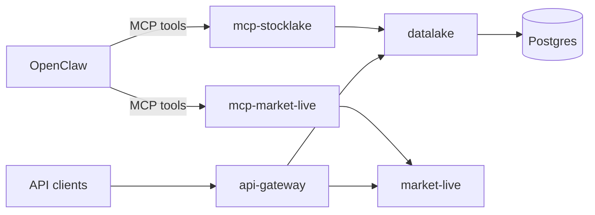

# Overall Platform Architecture

This document describes the end-to-end platform architecture, service boundaries, runtime topology, and how OpenClaw connects to the current system.

## Goals

- Keep `datalake` as canonical system of record.
- Keep live/current price reads independent from historical ingestion.
- Keep API routes thin and business logic in service/repository layers.
- Keep OpenClaw integration explicit and testable.
- Preserve migration paths: Postgres now, TimescaleDB/DuckDB later.

## High-level components

- `packages/stocklake-tiingo`
  - shared async Tiingo client (daily EOD HTTP API, retries)
  - consumed by `datalake` and `market-live` via thin service shims; not a runtime HTTP service
- `services/datalake`
  - canonical historical EOD store
  - Tiingo-backed ingestion and backfill
  - Postgres persistence via SQLAlchemy + Alembic
- `services/market-live`
  - live/current bar reads from provider APIs (uses the same shared Tiingo client library)
  - no canonical write-path ownership
- `services/api-gateway`
  - SaaS-facing HTTP facade
  - composes datalake + market-live data
- `services/mcp-stocklake`
  - OpenClaw MCP interface for historical/canonical workflows
- `services/mcp-market-live`
  - OpenClaw MCP interface for current/live workflows
- `openclaw/skills/*`
  - behavior guidance for agent tool usage (not business logic)

## Runtime topology (current phase)

- `postgres` in its own container
- service stack in containers (`datalake`, `market-live`, `api-gateway`, `mcp-market-live`)
- OpenClaw in its own container
- all containers on shared Docker network for local development

## Data and control flow

## Service boundaries and contracts

- `datalake` owns canonical historical records and ingestion metadata.
- `market-live` owns current/latest provider fetches and should not mutate canonical historical state.
- `api-gateway` owns public API shape and orchestrates service calls.
- MCP services expose agent-safe operations and delegate to service APIs/runtime adapters.
- Skills encode how agents should use tools; they do not contain domain logic.

## Storage model expectations

- one canonical row per `(ticker_id, trading_date)` in historical bars
- idempotent upsert semantics for bar writes
- preserve both raw and adjusted Tiingo fields
- date-driven backfills with sync-state tracking

## Evolution path

- Postgres remains the primary write store in this phase.
- TimescaleDB-specific optimizations are deferred.
- DuckDB is reserved for analytics/export acceleration, not canonical writes.
- service boundaries are kept strict so containers can be split further without major refactoring.

## Operational baseline

- Core local startup:
  - `./scripts/dev-compose.sh up -d --build postgres datalake market-live api-gateway mcp-market-live`
- Core health checks:
  - `http://localhost:8000/health` (`datalake`)
  - `http://localhost:8001/health` (`market-live`)
  - `http://localhost:8080/health` (`api-gateway`)
- **Python tooling:** repo-root **uv** workspace (`pyproject.toml`, `uv.lock`) for `datalake`, `market-live`, `mcp-stocklake`; optional **per-service** `services/<name>/.venv` via `make venv-service SERVICE=<name>` or `scripts/bootstrap-service-venv.sh` for Jupyter/IDE isolation.
- **API exploration:** template notebooks `services/*/notebooks/explore.ipynb` (not CI); see root `README.md`.

For OpenClaw startup and automated wiring, see `docs/openclaw-bringup-and-connection.md`. For MCP install commands, see `docs/openclaw-integration.md`.
